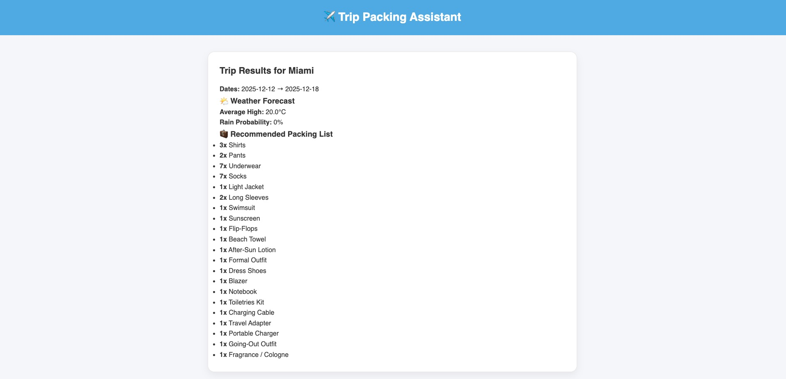
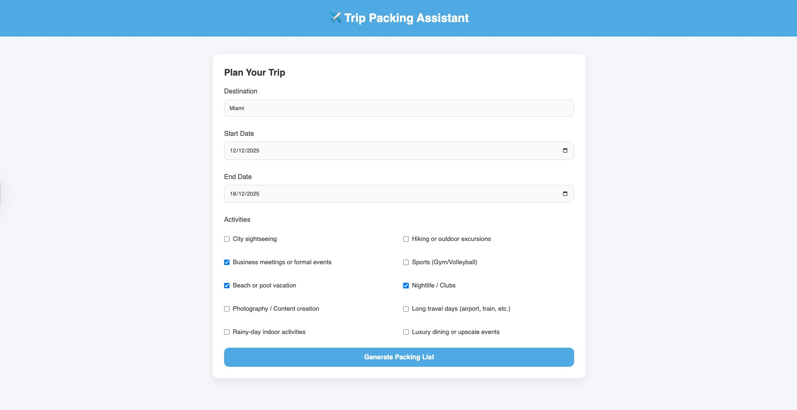
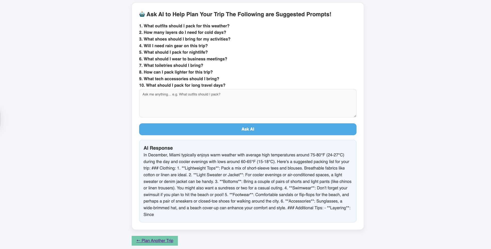
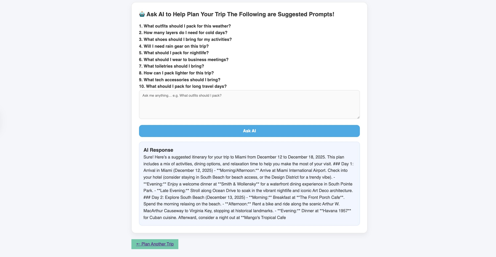

# Trip Packing Assistant

## The Big Idea

### Why We Built This
Packing sounds simple—until you actually start doing it. During our study-abroad semesters in London and Barcelona, we frequently traveled across Europe on budget airlines with strict luggage limits, only to make the same mistakes over and over: bringing heavy winter clothes to warm destinations, forgetting essentials like outlet adapters, misjudging local weather, or simply not having enough time to plan properly. The Trip Packing Assistant was born directly from these frustrations, created to solve a problem we deeply experienced as students and travelers.

### Goal
To build a tool that automatically creates a personalized, optimized packing list based on:
Destination
1. Trip duration
2. Weather forecast
3. Planned activities
4. Carry-on constraints

And for an added “wow factor,” we designed an optional AI Trip Assistant that allows users to ask follow-up travel questions in natural language.

## User Instructions
To use the Trip Packing Assistant, users simply enter their destination, trip dates, and planned activities. Once the form is submitted, the application retrieves a weather forecast for those dates, analyzes the expected conditions, calculates trip length, and incorporates activity requirements to generate a customized packing list. The results page presents a clear summary of the weather—including average high temperatures and rain probability—alongside an optimized checklist of clothing and essentials. An optional AI question box allows users to ask follow-up questions, such as outfit suggestions, packing strategies, or tips tailored to specific travel situations. 

To run the application yourself, you only need to provide a weather API key and an OpenAI API key in an .env file; once those are set, the app is fully ready to launch in Flask.

Activities: 10 Activities including different travel purposes for the users to choose base on needs

To help the user better navigate our OpenAI chatbox, we also provided example questions prompt for inspirations: 

## Implementation Information

### System Architecture
User Input → app.py → weather_service.py → packing_engine.py → results.html
                                               ↓
                                         llm_service.py (optional)

### Module Responsibilities
app.py — Application Controller:
    Renders forms
    Handles POST requests
    Combines weather + packing logic
    Passes results to templates

weather_service.py — Weather API Layer:
    Fetches 7-day forecast
    Extracts:
        Avg high temperature
        Rain probability
    Supplies weather object to packing engine

packing_engine.py — Core Packing Logic:
    Determines:
        Clothing quantities
        Seasonal adjustments
        Special activity items
        Rain/cold/hot-weather gear
This file demonstrates solid rule-based decision making.

llm_service.py — AI Assistant (Optional):
    Even though final integration was removed for reliability, this module:
        Shows readiness for LLM workflows
        Frames trip context as prompts
        Would return helpful natural language answers

Templates (index.html, results.html, base.html):
    Use Jinja templating
    Clean, responsive layout
    Separation of concerns between layout and content
    UI design consistent across pages

### Flowchart:
           ┌────────────────────┐
           │ User Inputs Trip   │
           │ Destination/Dates  │
           └──────────┬─────────┘
                      │ POST
                      ▼
            ┌───────────────────────┐
            │ Flask Controller      │
            │ (app.py)             │
            └──────────┬────────────┘
                       │ Calls
                       ▼
        ┌──────────────────────────────┐
        │ Weather Service              │
        │ - fetch API forecast         │
        │ - compute avg temp & rain    │
        └──────────┬───────────────────┘
                  │
                  ▼
        ┌──────────────────────────────┐
        │ Packing Engine               │
        │ - evaluate weather           │
        │ - evaluate activities        │
        │ - generate packing list      │
        └──────────┬───────────────────┘
                   │ Sends results
                   ▼
         ┌──────────────────────────────┐
         │ results.html Template        │
         │ - weather summary            │
         │ - packing checklist          │
         │ - optional AI Q&A            │
         └──────────────────────────────┘

## Results
Weather Integration
    Displays 7-day trends
    Real data changes packing recommendations
    Prevents under-packing for cold trips or over-packing for warm ones

🧳 Optimized Packing List
    Adapts to trip length
    Always includes essentials
    Changes quantities dynamically
    Adjusts for activities (gym gear, swimwear, formal clothes)

🤖 AI Assistant
    Helps explain packing suggestions
    Answers style/outfit questions
    Adds conversational UX experience

📸 Screenshots (Insert Later)
    Home page
    Results page with packing list
    AI Q&A panel

## Project Evolution/Narrative
The development of the Trip Packing Assistant unfolded through several iterative stages, each of which strengthened the project’s structure, functionality, and usability.

### Phase 1 — Ideation
The project began with a personal realization: packing for travel during our study-abroad semesters was consistently stressful and inefficient. We identified a clear pain point and set out to design a system that could automate packing decisions using structured rules informed by weather data and user activities.

### Phase 2 — Building the Weather and Packing Engine
Our first functional milestone involved constructing the backend logic. We implemented the weather API to retrieve real forecast data and then built the packing engine to interpret that information. Activity-based rules were added shortly after, allowing the system to adjust recommendations for hiking, gym sessions, beach plans, and other scenarios.

### Phase 3 — Modularization
As the codebase grew, we reorganized it to improve clarity and maintainability. Following feedback, we moved core logic into a dedicated /services directory, eliminated redundant functions, renamed modules to meaningful, descriptive filenames, and ensured all imports were placed consistently at the top of each file. This restructuring significantly improved readability and scalability.

### Phase 4 — AI Integration
We then designed and implemented an LLM service to enhance the user experience with an optional AI Q&A feature. The results page was connected to this system so users could ask questions about packing or travel preparation. Although we ultimately removed the live API calls for stability, we preserved the architectural framework to demonstrate our understanding of modern AI workflows.

### Phase 5 — UI and Templates
With the backend in place, we refined the user interface. We established a consistent layout through a shared base.html template, added spacing, icons, and card-style components for improved readability, and ensured that the page structure remained clean and mobile-friendly. These refinements helped create a smooth, intuitive user flow from input to results.

### Phase 6 — Polish and Finalization
In the final stage, we focused on improving clarity across the entire application. We refined output formatting, enhanced the structure of the results page, cleaned up documentation, and ensured that the user experience felt cohesive from start to finish. 

However, there was only one flaw of this project. We intended to support longer-duration weather forecasts for users planning extended trips, but due to restrictions in our current OpenWeather API subscription, our predictions are limited to a maximum of 5 days ahead.

## Attribution
Weather API: Open-Meteo or other free weather APIs
Flask documentation
Jinja templating documentation
OpenAI Python SDK (for optional AI assistant)
Starter code patterns learned in OIM3640
Debug & Polish assistant: Copilot and ChatGPT
All UI and logic authored by Thomas Song & Astrid Yuan